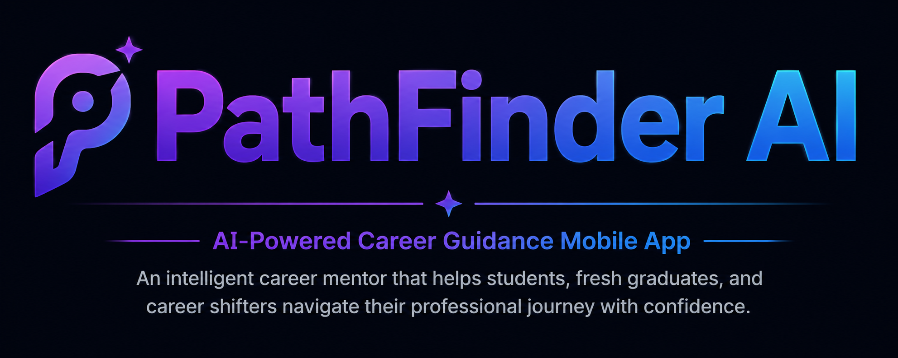

<p align="center">
  
</p>

<h1 align="center">
🚀 PathFinder AI
</h1>

<p align="center">
<b>AI-Powered Career Guidance Mobile Application</b>
</p>

<p align="center">
Helping students, fresh graduates, and career changers navigate their professional journey using Artificial Intelligence.
</p>

<p align="center">

[🎥 Demo](YOUR_VIDEO_LINK) •
[📱 APK](YOUR_APK_LINK) •
[🌐 Backend](YOUR_BACKEND_REPO) •
[💻 Admin Dashboard](YOUR_ADMIN_REPO)

</p>

---

# ✨ Overview

PathFinder AI is an intelligent career guidance mobile application developed using **Flutter** as part of the **ITI Graduation Project**.

The application combines **Artificial Intelligence**, **CV Analysis**, **Job Matching**, **Interview Preparation**, and **Personalized Learning Roadmaps** into one platform that helps users make smarter career decisions.

---

# 🌟 Features

### 📄 AI CV Analysis

- Upload your CV
- AI-powered resume scoring
- Detect strengths & weaknesses
- Missing skills analysis
- Personalized recommendations

---

### 🤖 AI Career Mentor

- Chat with AI
- CV-aware conversations
- Career guidance
- Powered by Gemini AI + RAG

---

### 🗺️ Personalized Learning Roadmaps

- Learning plans
- Target role roadmap
- Skill progression
- Career milestones

---

### 💼 AI Job Matching

- Personalized jobs
- Skills-based recommendations
- Smart matching algorithm

---

### 🎤 Interview Simulator

- AI-generated interview questions
- Role-specific practice
- Improve interview confidence

---

### 📝 Cover Letter Generator

Generate professional cover letters instantly.

---

### 🔔 Smart Notifications

Receive updates about:

- New Job Matches
- Roadmap Progress
- AI Recommendations
- Interview Reminders

---

# 📸 Screenshots

<table>
<tr>
<td align="center">
<b>Overview</b><br>

</td>
<td align="center">
<b>Interview Session</b><br>

</td>
</tr>

<tr>
<td align="center">
<b>AI Logs</b><br>

</td>
<td align="center">
<b>Skills</b><br>

</td>
</tr>

<tr>
<td align="center">
<b>CV Analysis</b><br>

</td>
<td align="center">
<b>Job Matches</b><br>

</td>
</tr>

<tr>
<td align="center">
<b>Jobs</b><br>

</td>
<td align="center">
<b>Courses</b><br>

</td>
</tr>

<tr>
<td align="center">
<b>Career Path</b><br>

</td>
<td align="center">
<b>RAG Document</b><br>

</td>
</tr>

<tr>
<td align="center">
<b>Users</b><br>

</td>
<td></td>
</tr>
</table>

---

# 🏗️ Architecture

```
lib/
│
├── app/
├── core/
├── features/
│   ├── data/
│   ├── domain/
│   └── presentation/
│
├── shared/
└── main.dart
```

The project follows **Feature-First Clean Architecture**, ensuring scalability, maintainability, and testability.

---

# 🛠️ Tech Stack

### Mobile

- Flutter
- Dart

### Architecture

- Clean Architecture
- Feature-First Structure

### State Management

- Flutter Bloc
- Cubit

### Dependency Injection

- GetIt
- injectable

### Networking

- Dio

### Backend

- Node.js
- Express.js
- Supabase (PostgreSQL)

### Authentication

- JWT Authentication

### AI Services

- Google Gemini AI
- Retrieval-Augmented Generation (RAG)

### Localization

- easy_localization
- Arabic & English
- RTL / LTR Support

### Design

- Figma

---

# 🚀 Getting Started

Clone the repository

```bash
git clone YOUR_REPO_LINK
```

Install dependencies

```bash
flutter pub get
```

Run the application

```bash
flutter run
```

---

# 💡 My Contributions

- Developed the Home module
- Built the AI Chat feature
- Implemented CV Upload & Analysis
- Created Notifications module
- Developed Search functionality
- Integrated Flutter with Node.js backend using Dio
- Applied Clean Architecture across features
- Integrated Google Gemini AI with RAG context
- Added Arabic & English localization with RTL support
- Managed Git branches and Pull Requests

---

# 🔮 Future Improvements

- Voice AI Assistant
- Resume Builder
- Internship Recommendation
- AI Career Insights
- Real-time Notifications
- Dark Mode
- Community Features

---

# 👨‍💻 Team

This project was built as part of the **Information Technology Institute (ITI)** Mobile Application Development Track.

A special thanks to every team member whose dedication and collaboration made **PathFinder AI** possible.

---

# 🎥 Demo

🔗 **Project Walkthrough**

YOUR_VIDEO_LINK

---

# ⭐ If you like this project

Give it a ⭐ on GitHub!
